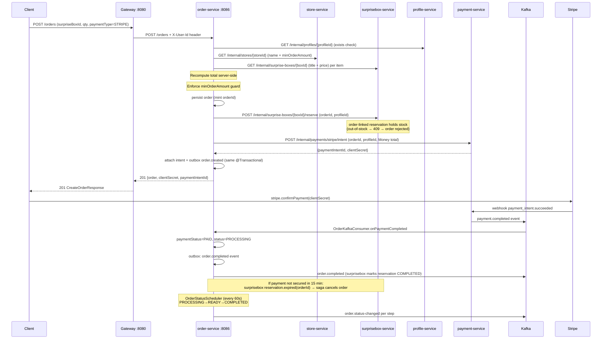

# fw-order-service

[← FoodWise platform overview](https://github.com/tapok332/foodwise-platform)

**Checkout orchestrator for the FoodWise food-rescue marketplace.**
Validates cart items against live store data, recomputes prices server-side, creates Stripe PaymentIntents atomically,
drives the order lifecycle via a Kafka choreography saga, and enforces per-user ownership on every read.


---

## Overview

`fw-order-service` is the single point of truth for order creation and lifecycle management inside FoodWise.
It owns the `orders`, `order_items`, and `order_status_history` tables in PostgreSQL (schema `foodwise_orders`),
publishes domain events through a transactional outbox, and consumes payment and reservation events to drive saga
compensation. The gateway routes all `/orders/**` traffic here; inter-service calls arrive via the internal network
authenticated with `X-Internal-Token`.

---

## Architecture

The service follows **hexagonal architecture (ports & adapters)** with a separate, framework-free domain model — see [ADR 0014](https://github.com/tapok332/foodwise-platform) for the platform-wide decision.

```
kh.karazin.foodwise.order/
├── domain/              # pure Java: Order aggregate, OrderItem, VO ids, enums, ResolvedOrderLine
│                        #   — status lifecycle, ownership, min-amount and idempotent saga transitions
├── application/
│   ├── port/in/         # OrderUseCase, OrderSagaUseCase, AdvanceOrdersUseCase (+ commands/results)
│   ├── port/out/        # OrderRepository, Store/Profile/SurpriseBox/Payment gateways, OrderEventPublisher
│   └── usecase/         # OrderService, OrderSagaService, OrderFulfillmentService — @Transactional boundaries
├── adapter/
│   ├── in/rest/         # OrderController, InternalOrderController, wire DTOs, explicit OrderRestMapper
│   ├── in/kafka/        # OrderKafkaConsumer (idempotent saga events)
│   ├── in/scheduler/    # OrderStatusScheduler (mock-fulfillment cadence + kill switch)
│   └── out/
│       ├── persistence/ # JPA entities, Spring Data repos, OrderPersistenceAdapter
│       ├── client/      # 4 Resilience4j clients + gateway adapters
│       └── messaging/   # OrderEventPublisherAdapter (transactional outbox)
└── config/              # Spring wiring: security, Kafka, RestClient, OrderProperties
```

Layer rules are enforced by [`HexagonalArchitectureTest`](src/test/java/kh/karazin/foodwise/order/architecture/HexagonalArchitectureTest.java) (ArchUnit, runs in `gradlew test` and CI): `domain` depends on no framework and no outer layer (the only sanctioned exception is the shared `Money` value object); `application` talks to the outside world only through ports; `@RestController` / `@KafkaListener` / `@Entity` types exist only in their adapter packages.

Business invariants live in the [`Order`](src/main/java/kh/karazin/foodwise/order/domain/Order.java) aggregate: server-resolved pricing, the minimum-order guard, ownership (`assertVisibleTo` / `cancelBy`), the status lifecycle and the idempotent saga transitions (`markPaid`, `markPaymentFailed`, `expireReservation`). Each status change records a pending history entry that the persistence adapter drains into the audit table on save — so it is impossible to change status without writing history.

---

## Engineering Highlights

### Ownership Enforcement / Anti-IDOR

`GET /orders/{orderId}` and `PUT /orders/{orderId}/cancel` both extract the caller's identity from the
gateway-injected `X-User-Id` header and pass it to `OrderUseCase.getForUser` and `cancel` respectively. The
[`Order`](src/main/java/kh/karazin/foodwise/order/domain/Order.java) aggregate compares its `profileId` against the
caller (`assertVisibleTo` / `cancelBy`); a mismatch throws a domain `OrderAccessDeniedException` that the use case
translates to `FORBIDDEN` (HTTP 403), not 404. The internal controller (`InternalOrderController`) uses the separate
`getUnscoped` method — named deliberately to signal that any new caller must consciously opt in.
`OrderControllerSecurityTest` asserts the 403 path as a regression guard.

### Server-Side Price Recompute

`CreateOrderRequest.items` contains only `{surpriseBoxId, quantity}`. No price or name fields are accepted from the
client. The placement use case (`OrderService.placeOrder`) resolves every line item's `title` and `price` (a `Money`
value object) through the `SurpriseBoxGateway` port; `Order.place` then computes the total inside the aggregate via
`Money.times(quantity).plus(...)`. A box that cannot be priced — whether an infra failure or an incomplete payload,
both collapsed to `null` by the gateway adapter — causes an immediate 503: the service refuses to create an order
against an unresolvable price rather than charge an incorrect amount.

### Order-First Stripe Payment Flow

`POST /orders` persists the order and, within the same `@Transactional` boundary, **reserves the box(es)** in
surprise-box-service via the `SurpriseBoxGateway.reserve` port (holding stock for the order awaiting payment,
[ADR 0015](../docs/decisions/0015-reserve-then-order-saga.md)), then calls the `PaymentGateway` port
(`createStripeIntent`). The `CreateOrderResponse` record returns `paymentClientSecret` and `paymentIntentId` to the
frontend, which calls `stripe.confirmPayment(clientSecret)` directly. An out-of-stock box rejects the order before any
charge; if Stripe is unavailable the entire transaction rolls back — an order without a PaymentIntent is never
persisted (an orphaned reservation self-heals via the 15-minute expiry). If the reservation expires before payment is
secured, surprise-box-service emits `reservation.expired` and the saga cancels the order. Cash orders skip the payment
gate and the reservation, and start directly in `PROCESSING`.

### Event-Driven Status Transitions and DLT

Every status transition is recorded on the `Order` aggregate and drained into `order_status_history` by the
persistence adapter, while the use case publishes the event through the `OrderEventPublisher` port — implemented by
`OrderEventPublisherAdapter` over `OutboxPublisher` and the transactional outbox (`outbox_events` table). `KafkaConfig`
enables Kafka producer idempotence (`acks=all`, `enable.idempotence=true`, `transaction-id-prefix=order-tx-`) and
manual offset acknowledgment. The `adapter/in/kafka` consumer (`OrderKafkaConsumer`) acks only on success; on failure
the `KafkaErrorHandlerConfig` (shared from `fw-common`) retries
and routes poison messages to `<topic>.DLT`. All consumed events go through `IdempotentConsumer`, which deduplicates
by event ID in the `processed_events` table — redeliveries are silently skipped.

### Resilient Inter-Service Clients

All four downstream clients (`StoreServiceClient`, `ProfileServiceClient`, `SurpriseBoxServiceClient`,
`PaymentServiceClient`, all in `adapter/out/client` behind their gateway ports) use the Resilience4j programmatic API
(`circuitBreaker.executeSupplier(...)`) instead of annotations. This keeps exception-to-domain mapping in a single
linear block:

- `404` from upstream → typed `FoodWiseException(ENTITY_NOT_FOUND)` — surfaced as HTTP 404 to the caller.
- Other `4xx` → `FoodWiseException(SERVICE_UNAVAILABLE)` — contract drift, not an outage.
- Circuit-breaker `OPEN` or any `5xx` / network error → `null` fallback — the placement use case rejects with 503.

`HttpClientErrorException` and `FoodWiseException` are declared in `ignoreExceptions` so that business declines never
trip the breaker. Four named breaker instances (`storeService`, `profileService`, `surpriseboxService`,
`paymentService`) share a common default config (sliding window 10, failure threshold 50%, open wait 10 s).

### Money Value Object

`Money` from `fw-common` is embedded in the `OrderEntity` and `OrderItemEntity` JPA mappings (`adapter/out/persistence`)
as two columns each (`total_price_amount_minor BIGINT`, `total_price_currency VARCHAR(3)`). All arithmetic (`times`, `plus`) and
comparisons (min-order-amount guard) operate on minor units to eliminate floating-point error. Jackson 3 serializes
`Money` as `{"amount":"300.00","currency":"UAH"}`. Every outbox payload carries `Money` end-to-end; no separate
currency string field exists alongside amounts.

---

## Checkout Flow



---

## API

### Public Endpoints (via gateway `/orders/**`)

| Method | Path | Auth | Description |
|--------|------|------|-------------|
| `POST` | `/orders` | `isAuthenticated()` | Create order; returns `clientSecret` for Stripe orders |
| `GET` | `/orders` | `isAuthenticated()` | Paginated order history for the calling user |
| `GET` | `/orders/{orderId}` | `isAuthenticated()` | Get a single order — ownership enforced (403 on mismatch) |
| `PUT` | `/orders/{orderId}/cancel` | `isAuthenticated()` | Cancel order — only `PENDING` orders, ownership enforced |
| `PUT` | `/orders/{orderId}/status` | `ADMIN` role | Admin status override (any target status) |
| `POST` | `/orders/{orderId}/refund` | `ADMIN` role | Trigger Stripe refund; returns 202 Accepted |

### Internal Endpoint (not reachable from public gateway)

| Method | Path | Description |
|--------|------|-------------|
| `GET` | `/internal/orders/{orderId}` | Unscoped lookup for trusted inter-service calls |

### Order Status Transitions

| From | To | Trigger |
|------|----|---------|
| _(new)_ | `PENDING` | `POST /orders` with `paymentType=STRIPE` |
| _(new)_ | `PROCESSING` | `POST /orders` with `paymentType=CASH` |
| `PENDING` | `PROCESSING` | `payment.completed` Kafka event (`OrderSagaHandler`) |
| `PENDING` | `CANCELLED` | `payment.failed` Kafka event / user cancel / reservation expired |
| `PROCESSING` | `READY` | Admin `PUT /status` or demo scheduler |
| `READY` | `COMPLETED` | Admin `PUT /status` or demo scheduler (pickup code generated on entry to READY) |
| Any non-terminal | `CANCELLED` | `PUT /{orderId}/cancel` (user, PENDING only) or `reservation.expired` saga |
| `COMPLETED` / `CANCELLED` | — | Terminal; `next()` returns self, scheduler skips |

### Payment Status

| Value | Meaning |
|-------|---------|
| `PENDING` | PaymentIntent created, awaiting confirmation |
| `PAID` | `payment_intent.succeeded` webhook received |
| `FAILED` | `payment_intent.payment_failed` received |
| `REFUNDED` | `charge.refunded` webhook received |
| `AUTHORIZED` | Reserved for manual capture (currently unused) |

---

## Events

### Produced (via transactional outbox)

| Topic | Payload type | When |
|-------|-------------|------|
| `order.created` | `OrderCreatedPayload` | On `POST /orders` success |
| `order.status-changed` | `OrderDto` | On any status transition via `updateOrderStatus` |
| `order.completed` | `OrderCompletedPayload` | On `payment.completed` — consumed by surprisebox-service |
| `order.cancelled` | `OrderCancelledPayload` | On user cancel, payment failure, or reservation expiry |

### Consumed

| Topic | Handler | Action |
|-------|---------|--------|
| `payment.completed` | `OrderKafkaConsumer.onPaymentCompleted` | Mark PAID, move to PROCESSING, publish `order.completed` |
| `payment.failed` | `OrderKafkaConsumer.onPaymentFailed` | Mark FAILED, cancel order, publish `order.cancelled` |
| `surprise-box.reserved` | `OrderKafkaConsumer.onSurpriseBoxReserved` | Log reservation (placement reserved synchronously — informational; `orderId=null` standalone events are skipped) |
| `reservation.expired` | `OrderKafkaConsumer.onReservationExpired` | Cancel the order if still awaiting payment, publish `order.cancelled` ([ADR 0015](../docs/decisions/0015-reserve-then-order-saga.md); a PAID order is never cancelled by a stale expiry; `orderId=null` standalone events are skipped) |

All consumers are idempotent via `IdempotentConsumer` (deduplication by event ID in `processed_events` table).
Failed messages retry and route to `<topic>.DLT`.

---

## Data Model

**Table: `orders`**

| Column | Type | Notes |
|--------|------|-------|
| `id` | `UUID` PK | `uuid_generate_v4()` |
| `profile_id` | `UUID` NOT NULL | Owner — used for ownership check |
| `store_id` | `UUID` NOT NULL | |
| `store_name` | `VARCHAR(255)` | Denormalized at order creation |
| `status` | `VARCHAR(50)` | `PENDING / PROCESSING / READY / COMPLETED / CANCELLED` |
| `payment_type` | `VARCHAR(50)` | `CARD / CASH / ONLINE / STRIPE` |
| `payment_status` | `VARCHAR(50)` | `PENDING / PAID / FAILED / REFUNDED / AUTHORIZED` |
| `delivery_type` | `VARCHAR(50)` | `PICKUP / DELIVERY / EXPRESS_DELIVERY` |
| `delivery_address` | `VARCHAR(500)` | |
| `pickup_code` | `VARCHAR(10)` | 6-digit code generated on entry to `READY` |
| `total_price_amount_minor` | `BIGINT` NOT NULL | Money — minor units |
| `total_price_currency` | `VARCHAR(3)` NOT NULL | ISO-4217 |
| `stripe_payment_intent_id` | `VARCHAR(255)` | Unique when present |
| `paid_at` | `TIMESTAMPTZ` | Set by saga on `payment.completed` |
| `failure_code` | `VARCHAR(100)` | |
| `failure_message` | `VARCHAR(1000)` | |
| `created_at` / `updated_at` | `TIMESTAMPTZ` | Auto-updated by trigger |

**Table: `order_items`**

| Column | Type | Notes |
|--------|------|-------|
| `id` | `UUID` PK | |
| `order_id` | `UUID` FK → `orders` | Cascade delete |
| `surprise_box_id` | `UUID` | |
| `name` | `VARCHAR(255)` NOT NULL | Resolved from surprisebox-service at creation |
| `price_amount_minor` | `BIGINT` NOT NULL | Money — minor units |
| `price_currency` | `VARCHAR(3)` NOT NULL | |
| `quantity` | `INT` NOT NULL | |
| `image_url` | `VARCHAR(500)` | |

**Table: `order_status_history`** — append-only audit trail; one row per transition.

**Tables: `outbox_events`, `processed_events`** — transactional outbox and consumer idempotency (from `fw-common`).

Managed by Flyway (`V1__create_order_tables.sql`, `V2__add_payment_fields.sql`). Hibernate runs in `validate` mode.

---

## Configuration

| Environment Variable | Default | Description |
|---------------------|---------|-------------|
| `SPRING_DATASOURCE_URL` | `jdbc:postgresql://localhost:5432/foodwise_orders` | PostgreSQL connection |
| `SPRING_DATASOURCE_USERNAME` | `tapok332` | DB user |
| `SPRING_DATASOURCE_PASSWORD` | `admin` | DB password (override in production) |
| `SPRING_KAFKA_BOOTSTRAP_SERVERS` | `localhost:9092` | Kafka brokers |
| `INTERNAL_SERVICE_SECRET` | _(required)_ | Shared secret for `X-Internal-Token` inter-service auth |
| `ORDER_CURRENCY` | `UAH` | ISO-4217 code attached to outbox payloads |
| `ORDER_STRIPE_CURRENCY` | `uah` | Lowercase code Stripe expects on PaymentIntent |
| `ORDER_DEMO_AUTO_ADVANCE` | `true` | Demo scheduler: advance kitchen orders every 60 s |
| `SWAGGER_ENABLED` | `false` | Expose `/v3/api-docs` and Swagger UI |

Downstream service URLs (defaults are Docker Compose service names):

| Variable | Default |
|----------|---------|
| `services.store-service.url` | `http://store-service:8083` |
| `services.profile-service.url` | `http://profile-service:8082` |
| `services.surprisebox-service.url` | `http://surprisebox-service:8084` |
| `services.payment-service.url` | `http://payment-service:8087` |

---

## Running

### Full stack (recommended)

```bash
# From the repo root
docker compose up -d
```

Gateway is available at `http://localhost:8080`. Order service is proxied at `/orders/**`.

### Standalone

```bash
cd fw-order-service
export INTERNAL_SERVICE_SECRET=dev-secret
./mvnw spring-boot:run
```

Requires a running PostgreSQL on `localhost:5432` (database `foodwise_orders`) and Kafka on `localhost:9092`.

---

## Testing

```bash
./gradlew test
```

Test coverage includes:

- `OrderTest` — pure domain unit tests: total computation, min-amount guard, ownership, the status lifecycle and the
  idempotent saga transitions (no Spring, no mocks).
- `OrderStatusTest` — state machine unit tests: happy-path chain (`PENDING → PROCESSING → READY → COMPLETED`),
  terminal statuses self-loop, `isTerminal()` correctness.
- `OrderServiceTest` — use-case unit tests with mocked ports (repository + gateways + event publisher): IDOR
  ownership, server-side price recompute, the min-amount guard.
- `OrderControllerSecurityTest` — `@WebMvcTest` slice; asserts 403 on IDOR attempt (`getOrderById` cross-user),
  401/403 on unauthenticated/unprivileged cancel and status-update.
- `HexagonalArchitectureTest` — ArchUnit layer rules (domain purity, no application→adapter dependency, annotations
  confined to their adapter packages).
- `OrderMoneyPersistenceIT` — Testcontainers integration test: a domain order saved through the repository port
  round-trips its `Money` columns and computed total.
- `StoreServiceClientTest`, `ProfileServiceClientTest`, `SurpriseBoxServiceClientTest`,
  `PaymentServiceClientMoneySerializationTest`, `PaymentServiceClientErrorClassificationTest` — Resilience4j 4xx/5xx
  mapping; `SurpriseBoxGatewayAdapterTest` — incomplete-payload collapse.

